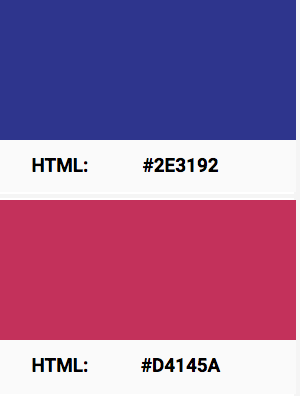

## Team (Contributors)

| Name                   | Email               |Student ID   |
|------------------------|---------------------|-------------|
| Brahim Kanouche        | bkano020@uottawa.ca |8879715      |
| Emmanuel Asinyo        | wkenn072@uottawa.ca |8890676      |
| Sébastien Sanscartier  | ssans075@uottawa.ca |6978470      |


# Project - BookStore website

A book store website to sell the pdf and hardcopies best seller and new coming books. The website will allow the user to browse for books, add them to chart and check out.

------------------

## Features
* Login as an existing user.
* Sign up as a new user.
* Display list of book.
* Browse per categorie.
* Search feature for books ( per title or per author ).
* Sort books by price.
* Add to chart.
* Check out by sending cheques or cash.

------------------


# Color Palette
## Primary Colors
We will be using these colors as our primary one through the whole website. With Black or white test.


## Complemenary Colors
We will be using those colors as our secondary color palette


# Fonts and Type scale

| scale category| font    | size   | case      |
|---------------|---------|--------|-----------|
|  H1           | Light   |  96    | Sentence  |
|  H2           | Light   |  60    | Sentence  |
|  H3           | Regular |  48    | Sentence  |
|  H4           | Regular |  34    | Sentence  |
|  H5           | Medium  |  24    | Sentence  |
|  H6           | Regular |  20    | Sentence  |
|  body         | Regular |  16    | Sentence  |
|  p            | Regular |  16    | Sentence  |
|  button       | Medium  |  14    | All caps  |

Main font type used is: **Arial**

## Development Environment Setup Guide
----------------------------------------
Please follow those instruction to set up your local work environment. (To be added)

Used technologies: 
 - HTML5
 - CSS3
 - Javascript
 - PHP
 - SQL


## Database Schema
----------------------------------------


### Setup: 

Please follow those instruction to set up your local machine. 

1. Download xampp: https://www.apachefriends.org/download.html 
2. Find and open ```php.ini``` in xampp file. For mac : Open your XAMPP application and ```press start``` on the ```general``` tab. After that go into the ```Volumes``` tab, and click ```mount```. Once it is mounted navigate click the ```explore``` button and it will open you the ```lampp``` folder, where all your application/apache related files are located.  
3. Add those lines to the end in your ```php.ini```. 
   - For mac: ```extension=pgsql.so```
   - For windows: ```extension=php_pdo_pgsql.dll``` and ```extension=php_pgsql.dll```
5. Pull this repository to your machine and make sure to locate at xampp/htdocs
6. For mac: from the ```lampp``` folder navigate to ```etc``` > ```extra``` > ```httpd-xampp.conf```. Open this file and in the section ```Since xampp 1.4.3``` change the ```Require admin``` to ```Require all granted```
7. Open in your browser ```http://localhost:8080/phpmyadmin/``` and click ```New``` at the left Navigator to create a new database. (```name= DatabaseName```, ```uft code= utf8_unicode_ci```) <br /> 
8. once ```DatabaseName``` created, navigate to your project location, usually on ```c:\xampp\htdocs\BookStore``` and import ```bookstore.sql```
9. Then ignore the error that shows up After clicking ```Go```. 

### Deployement Script: Running the Web Application

1. Open xampp and go to manage servers and start ```Apache``` and ```MySQL``` web server.
2. Open ```dbconnect.php``` and modify it.
3. To find where is your ```localhost/password```, please follow step
   
  - Step 1:
    - Locate phpMyAdmin installation path.
  - Step 2:
    - Open phpMyAdmin>config.inc.php in your favourite text editor.
  - Step 3:
    - $cfg['Servers'][$i]['auth_type'] = 'config';
    - $cfg['Servers'][$i]['user'] = 'root';
    - $cfg['Servers'][$i]['password'] = '';
    - $cfg['Servers'][$i]['extension'] = 'mysqli';
    - $cfg['Servers'][$i]['AllowNoPassword'] = true;
    - $cfg['Lang'] = '';
    
4. navigate to http://localhost/BookStore/ and you are all set :D

N.B: if you created a new folder named ```example``` to pull the repository to it, make sure to add the name of the folder in your URL (e.g: http://localhost/example/BookStore/)

## Setting-up the testing environment

Unit tesiting: For the unit testing we used [Composer](https://getcomposer.org/) (v1.9.3) and [PHPUnit](https://phpunit.de/) (v9.0)

### Composer

Installing composer on windows/osx is different and you can find extra information on how to install it here: https://getcomposer.org/doc/00-intro.md
Theses commands will install composer globally on your machine, and can be used by any of your project. 

1. For mac, type in terminal: ```curl -sS https://getcomposer.org/installer | php```
2. rename it to composer for ease of use: ```mv composer.phar /usr/local/in/composer```
3. ```composer init```

### PHPUnit

1. ```composer require phpunit/phpunit```

To run the tests in the ```tests``` folder, run ```./vendor/bin/phpunit tests``` from inside your project.
